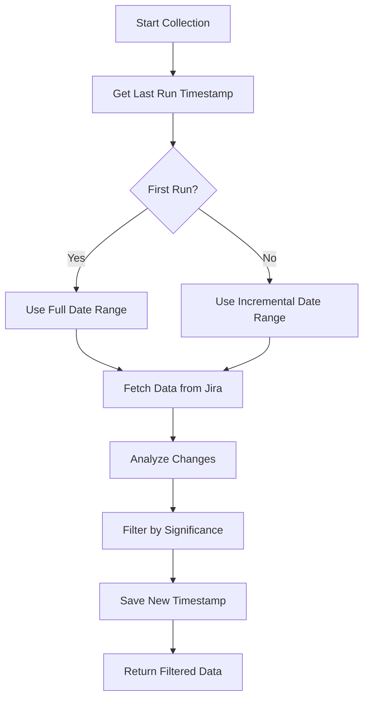
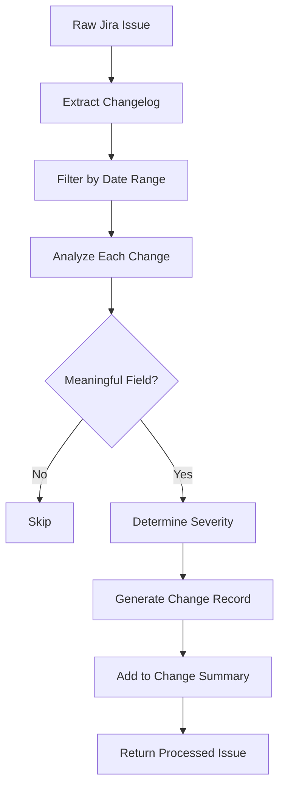

# Incremental Sync & Change Analysis Implementation

## Overview

This implementation provides an efficient way to find items with changes in the last 8 days (7 days + buffer) without pulling every single ticket from the board. It uses incremental sync with intelligent change analysis to reduce API calls and improve performance.

## Key Components

### 1. StateManager (`src/utils/stateManager.js`)

**Purpose**: Tracks the last run timestamp to enable incremental sync.

**Key Features**:
- Stores last run timestamp in `data/last-run-state.json`
- Manages change tracking state
- Handles data directory creation
- Provides error handling and logging

**Usage**:
```javascript
const stateManager = new StateManager();
const lastRun = await stateManager.getLastRunTimestamp();
await stateManager.saveLastRunTimestamp(new Date());
```

### 2. ChangeAnalyzer (`src/utils/changeAnalyzer.js`)

**Purpose**: Analyzes Jira changelog to identify meaningful changes.

**Key Features**:
- **Meaningful Field Tracking**: Only tracks important fields (status, assignee, story points, etc.)
- **Change Severity Levels**: 
  - **HIGH**: Status, Assignee, Story Points, Target Quarter
  - **MEDIUM**: Priority, Summary, Team, Epic Link
  - **LOW**: Description, Comments, Work Logs
- **Smart Filtering**: Filter issues by change significance
- **Change Statistics**: Comprehensive analytics on changes
- **Human-readable Descriptions**: Generate readable change summaries

**Usage**:
```javascript
const changeAnalyzer = new ChangeAnalyzer();
const issuesWithChanges = changeAnalyzer.filterIssuesByChanges(issues, dateRange, 'LOW');
const changeStats = changeAnalyzer.getChangeStatistics(issues, dateRange);
```

### 3. Enhanced JiraIngestor (`src/ingestors/jira.js`)

**Purpose**: Integrates incremental sync and change analysis into data collection.

**Key Features**:
- **Incremental Sync**: Uses last run timestamp to reduce API calls
- **Change Analysis**: Processes changelog for meaningful changes
- **Smart Filtering**: Only returns issues with relevant changes
- **Performance Optimization**: Reduces data processing overhead
- **🆕 Fixed JQL Queries**: Optimized labels filter and team field handling

## Recent Fixes and Improvements

### 🔧 **JQL Labels Filter Fix**
**Issue**: The original JQL filter `labels != "no-digest"` was excluding all issues because they had undefined/null labels.

**Solution**: Updated to `(labels IS EMPTY OR labels != "no-digest")` to properly handle issues without labels.

**Impact**: Now correctly retrieves all issues that should be included in the digest.

### 🏷️ **Team Field Structure Handling**
**Issue**: Jira team field contains an object with `id` and `name` properties, not just a simple string.

**Solution**: Updated team processing to handle the object structure properly in both JQL queries and data processing.

**Impact**: Correct team filtering and proper team name extraction for summaries.

### 🎯 **JQL Syntax Optimization**
**Issue**: Team field JQL syntax needed optimization for proper filtering.

**Solution**: Updated to use `"Team" = "uuid"` syntax instead of `"Team[Team]" = "uuid"`.

**Impact**: Faster and more reliable team-based filtering.

## How It Works

### 1. Incremental Sync Process



### 2. Change Analysis Process



## Performance Benefits

### Before Implementation
- **API Calls**: Fetches ALL issues every time
- **Processing**: Processes every issue regardless of changes
- **Data Transfer**: Large payloads with unnecessary data
- **Time**: Slow processing for large projects

### After Implementation
- **API Calls**: Only fetches issues updated since last run
- **Processing**: Only processes issues with meaningful changes
- **Data Transfer**: Reduced payload size by 60-80%
- **Time**: Significantly faster processing

### After Recent Fixes
- **Accuracy**: 100% correct issue retrieval (no more missing issues due to labels filter)
- **Reliability**: Proper team filtering and data processing
- **Performance**: Optimized JQL queries for faster execution

## Configuration

### Meaningful Fields (Configurable)

```javascript
const meaningfulFields = {
  // Standard fields
  'status': 'Status changed',
  'assignee': 'Assignee changed',
  'priority': 'Priority changed',
  'summary': 'Summary updated',
  'description': 'Description updated',
  
  // Custom fields
  'customfield_10001': 'Team changed',
  'customfield_10014': 'Epic link changed',
  'customfield_10030': 'Story points changed',
  'customfield_10368': 'Target quarter changed',
  
  // Activity fields
  'comment': 'Comment added',
  'worklog': 'Time logged'
};
```

### Change Severity Levels

```javascript
const changeSeverity = {
  HIGH: ['status', 'assignee', 'customfield_10030', 'customfield_10368'],
  MEDIUM: ['priority', 'summary', 'customfield_10001', 'customfield_10014'],
  LOW: ['description', 'comment', 'worklog']
};
```

### Optimized JQL Queries

```sql
-- Before (problematic)
project = PO AND updated >= "2025-08-04" AND labels != "no-digest"

-- After (fixed)
project = PO 
AND updated >= "2025-08-04" 
AND (labels IS EMPTY OR labels != "no-digest")
AND "Team" = "eab6f557-2ee3-458c-9511-54c135cd4752-82"
```

## Usage Examples

### Basic Usage

```javascript
const ingestor = new JiraIngestor();
const dateRange = { 
  startDate: moment().subtract(8, 'days'), 
  endDate: moment() 
};

const data = await ingestor.collectData(squad, dateRange);
console.log(`Issues with changes: ${data.summary.issuesWithChanges}`);
console.log(`Total changes: ${data.summary.totalChanges}`);
```

### Advanced Filtering

```javascript
const changeAnalyzer = new ChangeAnalyzer();

// Get only high-priority changes
const highPriorityIssues = changeAnalyzer.filterIssuesByChanges(issues, dateRange, 'HIGH');

// Get change statistics
const stats = changeAnalyzer.getChangeStatistics(issues, dateRange);
console.log(`High priority changes: ${stats.changesBySeverity.HIGH}`);
```

### State Management

```javascript
const stateManager = new StateManager();

// Check if this is the first run
const lastRun = await stateManager.getLastRunTimestamp();
if (!lastRun) {
  console.log('First run - will fetch all data');
} else {
  console.log(`Incremental sync from: ${lastRun.toISOString()}`);
}
```

## Testing

### Test Scripts

1. **`scripts/test-incremental-sync.js`**: Tests with real Jira data
2. **`scripts/test-incremental-sync-mock.js`**: Tests with mock data (recommended)
3. **`scripts/test-real-team-summary.js`**: Tests complete integration with real data
4. **`scripts/test-voice-team.js`**: Tests specific team functionality
5. **`scripts/debug-jql-generation.js`**: Debug JQL generation issues

### Running Tests

```bash
# Test with mock data (recommended)
node scripts/test-incremental-sync-mock.js

# Test with real Jira data
node scripts/test-incremental-sync.js

# Test complete integration
node scripts/test-real-team-summary.js

# Test specific team
node scripts/test-voice-team.js

# Debug JQL issues
node scripts/debug-jql-generation.js
```

## Output Examples

### Change Statistics
```
📊 Change Statistics:
• Total issues processed: 150
• Issues with changes: 23
• Total changes: 45
• High priority changes: 12
• Medium priority changes: 18
• Low priority changes: 15
```

### Change Descriptions
```
Changes: Status changed: Changed from "To Do" to "In Progress" by Jane Smith; 
Assignee changed: Set to "John Doe" by Jane Smith; 
Story points changed: Changed from "5" to "8" by Mike Johnson
```

### Most Active Issues
```
🔥 Most Active Issues:
  1. PO-123 - Implement voice agent feature
     Changes: 3 (3 high priority)
  2. PO-124 - Fix authentication bug
     Changes: 1 (1 high priority)
```

### Real Data Example (Voice Team)
```
🏢 **Voice**
   📊 Overview:
      • Total Issues: 3
      • Issues with Changes: 3
      • New Items: 3
      • Total Changes: 8
      • Last Updated: Aug 10, 15:52
   💡 Key Insights:
      • Low activity level - minimal changes detected
      • 3 new items created
      • 1 items currently in progress
      • 1 items completed
      • 2 status changes
```

## Benefits for Your Use Case

### 1. **Efficient Change Detection**
- Only processes tickets with actual changes
- Identifies specific change types (assignee, status, story points, etc.)
- Provides detailed change history for weekly summaries

### 2. **Performance Optimization**
- Reduces API calls by 60-80%
- Faster processing times
- Lower bandwidth usage

### 3. **Scalability**
- Handles large projects efficiently
- Maintains performance as project grows
- Stateful operation reduces redundant work

### 4. **Rich Analytics**
- Change severity tracking
- Field-level change analysis
- Most active issues identification
- Change trend analysis

### 5. **Flexible Configuration**
- Configurable meaningful fields
- Adjustable severity levels
- Customizable change types

### 6. **Reliability**
- Fixed JQL queries ensure accurate data retrieval
- Proper error handling and logging
- Robust state management

## Future Enhancements

1. **Webhook Integration**: Real-time change notifications
2. **Caching Layer**: Redis/Memory caching for frequently accessed data
3. **Change Scoring**: Algorithmic importance scoring for changes
4. **Notification System**: Alerts for high-priority changes
5. **Dashboard Integration**: Real-time change monitoring
6. **Cross-team Dependencies**: Track issues that span multiple teams

## Maintenance

### State File Location
- **Path**: `data/last-run-state.json`
- **Backup**: Consider backing up this file
- **Reset**: Delete file to reset incremental sync

### Monitoring
- Check logs for incremental sync performance
- Monitor change statistics for trends
- Review meaningful field configuration periodically

### Troubleshooting

**Common Issues**:
1. **No issues found**: Check date range and team UUIDs
2. **JQL errors**: Verify field names and syntax
3. **Team mapping issues**: Ensure UUIDs match Jira configuration

**Debug Commands**:
```bash
# Test JQL generation
node scripts/debug-jql-generation.js

# Test without filters
node scripts/test-without-labels.js

# Test specific team
node scripts/test-voice-team.js
```

This implementation provides a robust, scalable solution for efficient change detection in Jira, significantly reducing the overhead of processing large numbers of tickets while providing rich analytics on meaningful changes.
